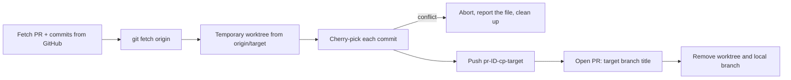

# node-cherrypicker: backport & cherry-pick GitHub pull requests to multiple branches

[](https://nodejs.org)
[](./LICENSE)
[](#security-and-privacy)

**node-cherrypicker is a local web app that automates `git cherry-pick` for GitHub pull requests.** Enter one or more
PR numbers, tick the branches you want them on (staging, production, a release branch, a snapshot…), and it
cherry-picks the commits onto each branch and opens a ready-to-review pull request for every one, with live progress.

It is built for the everyday "backport this fix to the release branches" and "ship this hotfix to staging and
production" job, so nobody has to remember the checkout, cherry-pick, push and open-PR steps by hand.

- Runs **on your laptop, against your own clone**. Nothing is hosted, and no token is written to disk.
- Works on a **temporary git worktree**, so your checked-out branch and uncommitted changes are never touched.
- Handles **many PRs onto many branches in one go**, and reports each branch separately.

> **Keywords:** cherry-pick pull request, backport pull request, git cherry-pick automation, hotfix to release
> branches, cherry-pick PR to multiple branches, GitHub backport tool, Node.js, React, Socket.IO, Octokit.

---

## Contents

- [Quick start](#quick-start)
- [How to use it](#how-to-use-it)
- [What it does for each branch](#what-it-does-for-each-branch)
- [Features](#features)
- [Requirements](#requirements)
- [Configuration](#configuration)
- [Security and privacy](#security-and-privacy)
- [Troubleshooting](#troubleshooting)
- [FAQ](#faq)
- [Project structure](#project-structure)
- [Development](#development)
- [Further reading](#further-reading)
- [Contributing](#contributing)
- [License](#license)

## Quick start

```bash
git clone https://github.com/arunnair018/node-cherrypicker.git
cd node-cherrypicker
npm install
npm run build     # builds the web UI once
npm start         # opens http://localhost:8086
```

That's all you need. There is nothing to configure first: sign-in, repository and branch names are all set in the app.

## How to use it

1. **Connect GitHub** (sidebar). If you already use the [GitHub CLI](https://cli.github.com) and ran `gh auth login`,
   you're signed in automatically. Otherwise paste a personal access token (see [Requirements](#requirements)).
2. **Choose your repository** (sidebar). Type the path to a local clone or press **Browse** to pick the folder.
   `owner/repo` is read from the clone's `origin` remote.
3. **List your servers** (sidebar). Type branch names separated by spaces (for example `staging production release-1.2`).
   They become one-click targets. You can also type any other branch (such as a snapshot) in the form.
4. **Enter PR numbers**, select the target branches, and press **Cherry-pick**.
   The form freezes, the page scrolls to the top, and a live progress view slides in.
5. **When it finishes**, open or copy the PR links (**Copy for Slack** gives one bullet per branch), then press
   **Dismiss** to return to a blank form. Your last 10 runs are kept in the **Recent picks** panel on the right.

Branches you use often move to a **Frequently used** group so they're easy to find.

## What it does for each branch



For every selected target branch, in order:

1. Creates a throwaway worktree on a new branch `pr-<ids>-cp-<target>` from `origin/<target>`.
2. Applies every commit of the PR(s) with `git cherry-pick -x` (so each commit records where it came from).
   - Merge commits are **skipped**.
   - Commits already present on the target are **skipped** (reported as "Already on this branch").
3. Pushes the branch and opens a pull request titled `[<target>] <original title>`, with a "Previous PR" list in
   the description. When you pick several PRs at once, the title and description come from the **first** one. You can
   open it as a **draft**.
4. Removes the worktree and the local branch. On failure it also removes the branch it pushed, if any.

If one branch fails (for example a **merge conflict**), the others still run, and the failure shows the exact file
and commit. Nothing is left half-done on the remote. If an open PR for that branch already exists, it is reused
instead of creating a duplicate.

## Features

- Cherry-pick **one or many PRs** onto **one or many branches** in a single run.
- **Live progress** per branch: create branch, cherry-pick, push, open PR, with per-commit status.
- **Conflict reporting** that names the file and commit instead of leaving a half-finished cherry-pick.
- **Safe by design**: temporary worktree, never touches your working tree, cleans up after itself.
- **Recent picks** history (last 10 runs) and **frequently used branches**.
- **Copy for Slack**: one bullet per branch with the full PR link.
- **Responsive UI** with light/dark themes, collapsible side panels, and drawers on small screens.
- Can **cancel** a running job. Survives a **page refresh** mid-run (the server owns the job).

## Requirements

| Need | Details |
|---|---|
| Node.js | 20 or newer |
| git | 2.31 or newer, with push access to the repository |
| A local clone | Of the repository, with an `origin` remote on github.com |
| GitHub access | Either `gh auth login` (recommended) or a personal access token |
| git identity | `user.name` and `user.email` set (cherry-picking creates commits) |

**Token permissions** (if you paste one instead of using the GitHub CLI): a classic token with the `repo` scope, or a
fine-grained token with **Contents: read & write** and **Pull requests: read & write** on the repository.
If your organisation uses SAML SSO, authorise the token for it.

## Configuration

**None is required.** Everything can be set in the app. For convenience, an optional `.env` file in the project root
provides defaults (see [`sample_env`](./sample_env)):

| Variable | Purpose | Default |
|---|---|---|
| `PORT` | Port the app listens on | `8086` |
| `SERVER_BRANCHES` | Pre-fills the Servers list (space or comma separated) | empty |
| `GIT_BASE_DIRECTORY` + `REPO` | Default repository path (`GIT_BASE_DIRECTORY` + `REPO`) | the folder you started it in, if it's a git repo |
| `GITHUB_ACCESS_TOKEN` | Use this token instead of the GitHub CLI | not set |
| `GITHUB_API_URL` | Point at a GitHub Enterprise API (also used for testing) | `https://api.github.com` |

`.env` is git-ignored. Never commit it.

## Security and privacy

- **Local only.** The server binds to `127.0.0.1` and rejects any request whose `Host` or `Origin` is not
  `localhost`, so other websites and other machines cannot reach it.
- **Your token stays in memory.** It is never written to disk, logged, or sent anywhere except GitHub. It is passed
  to git through environment variables, not command-line arguments, so it does not show up in the process list.
- **What the browser stores** (`localStorage`, on your machine only): the repository path, your server list, your last
  10 runs (PR numbers, branch names, PR links) and branch usage counts. No tokens.
- **No telemetry, no analytics, no third-party calls** other than the GitHub API and your git remote.
- Branch names are validated and git is run **without a shell**, so a branch name cannot inject a command.

## Troubleshooting

| Symptom | What it means / fix |
|---|---|
| `Conflict applying <sha> in <file>` | The commit doesn't apply cleanly on that branch. Backport it manually, then re-run for the other branches. |
| `Branch "x" doesn't exist on origin` | The target must exist on the remote. Check the spelling, or `git fetch` in your clone. |
| `Sign in to GitHub first` | Run `gh auth login`, or paste a token in the sidebar. |
| `Not found on GitHub` for a PR | Wrong number, or the token can't see that repository (check SSO authorisation). |
| `Push failed` | You need write access to the repository, or branch protection blocks the new branch name. |
| `Please tell me who you are` | Set `git config user.name` and `user.email` in your clone. |
| Nothing opens / blank page | Run `npm run build` first. Without a build only the API is served. |
| Port already in use | Set `PORT=9000` in `.env`, or stop the other process. |
| Browse button does nothing | The native folder dialog needs `osascript` (macOS), PowerShell (Windows) or `zenity` (Linux). Type the path instead. |

## FAQ

**How do I cherry-pick a pull request to multiple branches?**
Open the app, enter the PR number, select every branch you want it on, and press Cherry-pick. It creates one new
pull request per branch.

**How do I backport a GitHub PR to a release branch?**
Same flow: add the release branch to your server list (or type it in the form) and pick it as a target.

**Does it work with squash-merged or merged PRs?**
It cherry-picks the PR's own commits (as listed by GitHub), so PRs merged by merge commit, squash or rebase all work,
as long as those commits are still reachable (it fetches `refs/pull/<n>/head` to be sure). A PR that isn't merged yet
works too (you'll see a warning in the log).

**Will it change my current branch or local changes?**
No. All work happens in a temporary git worktree that is removed afterwards.

**Does it work with GitHub Enterprise?**
The API URL can be set with `GITHUB_API_URL`, but the app currently expects `github.com` style remotes. Treat
Enterprise as experimental.

**Is my token safe?**
It stays in memory on your machine and is only sent to GitHub. See [Security and privacy](#security-and-privacy).

**Why not `git cherry-pick` by hand or a GitHub Action?**
By hand you repeat checkout, cherry-pick, push and open-PR for every branch. node-cherrypicker does those steps for each
branch, in isolation, and shows you the result of each at a glance, without any workflow files in your repository.

## Project structure

```
node-cherrypicker/
├── index.js                 # server entry: Express + Socket.IO, serves the built UI
├── config.js                # loads optional .env
├── sample_env               # documented optional settings
├── src/                     # backend (see src/README.md)
│   ├── picker.js            #   the cherry-pick job runner (core logic)
│   ├── git.js               #   git helpers, repo inspection, temporary worktrees
│   ├── github.js            #   GitHub API wrapper (Octokit)
│   ├── auth.js              #   in-memory sign-in (GitHub CLI or token)
│   ├── routes.js            #   REST endpoints
│   ├── socket.js            #   real-time job protocol
│   └── guard.js             #   localhost-only protection
└── client-vite/client/      # frontend (see client-vite/client/README.md)
    └── src/                 #   React + Vite + Ant Design UI
```

## Development

```bash
npm install
npm --prefix client-vite/client install
npm run dev        # API with auto-restart on :8086 + Vite dev server on http://localhost:5173
```

| Script | What it does |
|---|---|
| `npm run dev` | Server (nodemon) and UI (Vite, hot reload) together |
| `npm run build` | Installs UI dependencies and builds the UI into `client-vite/client/dist` |
| `npm start` | Runs the server, serving the built UI |

`npm run dev` sets `NO_OPEN=1` inline, which works on macOS/Linux. On Windows set it in your shell or `.env`.

## Further reading

- [Backend architecture and code flow](./src/README.md)
- [Frontend architecture and code flow](./client-vite/client/README.md)

## Contributing

Issues and pull requests are welcome. Please read [CONTRIBUTING.md](./CONTRIBUTING.md) first. For security problems,
see [SECURITY.md](./SECURITY.md) instead of opening a public issue.

## License

[MIT](./LICENSE) © 2022-2026 Arun Kumar Nair. Free to use, modify and distribute, including commercially, with no warranty.

## Disclaimer

This is an independent open-source project. It is **not affiliated with, endorsed by, or sponsored by GitHub, Inc.**
GitHub and the GitHub logo are trademarks of GitHub, Inc.; they are used here only to describe what the tool works with.
node-cherrypicker creates branches and pull requests in the repositories you point it at. Use it on repositories you are
authorised to change, and review each pull request it opens.
