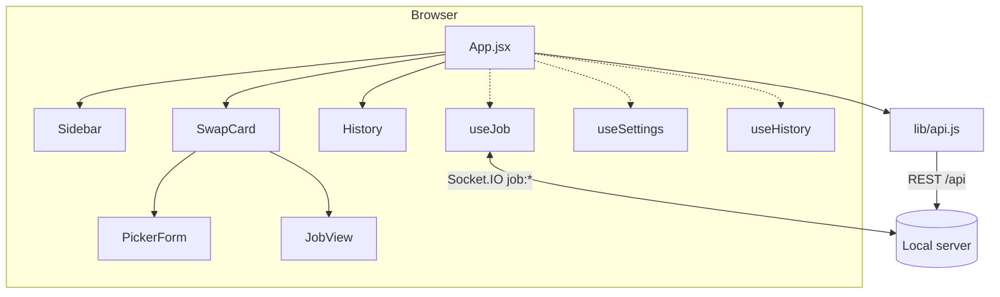

# Frontend: architecture and code flow

A single-page app built with **React 18**, **Vite 6** and **Ant Design 5** (used for inputs, buttons and the PR tag
input), with all look-and-feel in one plain CSS file. It has no router and no global state library: the state is small
and lives in `App.jsx` and a few hooks.

It talks to the local backend only: REST under `/api` and Socket.IO on the same origin. See the
[backend README](../../src/README.md) for the server side.

## Running it

| Command (from this folder) | What it does |
|---|---|
| `npm run dev` | Vite dev server on http://localhost:5173. It proxies `/api` and `/socket.io` to the backend on `:8086`, so run the backend too (or use `npm run dev` from the repo root, which starts both). |
| `npm run build` | Builds to `dist/`. The backend serves this folder, which is what `npm start` uses. |
| `npm run lint` | ESLint. |

## File map (`src/`)

| File | Responsibility |
|---|---|
| `main.jsx` | Entry. Wraps the app in Ant Design's `ConfigProvider` and picks the dark/light algorithm from the OS setting (`prefers-color-scheme`). |
| `App.jsx` | Wires everything together: loads config and auth, owns the settings, repo check, job, history, and panel/drawer state. |
| `lib/api.js` | `fetch` wrapper for the REST endpoints (`config`, `auth*`, `inspectRepo`, `browseRepo`, `prs`). |
| `lib/useJob.js` | The Socket.IO connection and the job state (`job`, `log`, `connected`, `start`, `cancel`, `dismiss`). |
| `lib/useSettings.js` | Repo path and the raw server-list text, persisted in `localStorage`. Also `parseServers()` (splits on whitespace/commas, de-dupes). |
| `lib/useHistory.js` | Records finished runs (last 10) and per-branch usage counts in `localStorage`. |
| `lib/useMediaQuery.js` | Tiny `matchMedia` hook (drives the narrow-screen drawers). |
| `components/Sidebar.jsx` | Left panel: GitHub sign-in, repository picker (with Browse), server list. |
| `components/PickerForm.jsx` | The form: PR tag input with live previews, target branches, draft toggle, Cherry-pick button. |
| `components/JobView.jsx` | The run view: progress bar, per-branch cards (steps, commits, errors), Copy for Slack, activity log. |
| `components/SwapCard.jsx` | Animates between the form and the run view. |
| `components/History.jsx` | Right panel: the last 10 runs. |
| `components/icons.jsx` | Inline SVG icons and the cherry logo (no icon library). |
| `css/styles.css` | Design tokens, glass cards, layout, responsive rules. |

## How it fits together

## Code flow

### Start-up
`App` calls `GET /api/config` (defaults) and `GET /api/auth` (who is signed in). `useSettings` fills blank settings from
those defaults the first time. A debounced effect (`useRepo`) calls `POST /api/repo/inspect` whenever the repo path changes
and the sidebar shows the verified `owner/repo`.

### Running a pick
1. **`PickerForm`** validates the inputs (signed in, repo valid, at least one PR and one branch) and calls `start()` from
   `useJob`, which emits `job:start` and waits for the server's acknowledgement. While waiting the form is **frozen**
   (dimmed and `inert`).
2. The server answers and broadcasts `job:snapshot`. `useJob` sets `job`, and `App` passes `side="back"` to `SwapCard`.
3. **`SwapCard`** plays the transition: the form fades out while drifting up, the page scrolls to the top, and the
   **`JobView`** rises in from below. The form is kept mounted until it has left, then unmounts, which is what resets it.
4. Every `job:update` replaces the `job` object. `JobView` is a pure function of it: progress bar, a card per target
   with its steps (green/red dots), commit list, and any error. `job:log` lines feed the collapsible activity log.
5. When the job leaves `running`, `useHistory` records it once (de-duplicated by job id) and bumps usage counts for
   branches that got a PR. Those counts drive **Frequently used**.
6. **Dismiss** emits `job:dismiss` and clears local state. `SwapCard` plays the transition in reverse and a fresh, blank
   form appears.

Because the **server owns the job** and always sends full state, a page refresh or dropped connection just resyncs: on
reconnect the server sends `job:snapshot`, and the UI opens straight on the run view if a job is still active.

### Layout and responsiveness
- **Wide screens (above 1100px):** three columns. The left sidebar and the right "Recent picks" panel each collapse to a
  slim rail (the choice is remembered). The centre card fills the window height: header and footer are pinned, the
  middle scrolls.
- **Tablet/phone (1100px and below):** a top bar appears and both panels become **slide-in drawers** with a dimmed
  backdrop (close with the X, a tap outside, or Escape). At 640px and below the layout tightens further and the
  Cherry-pick button goes full width.
- **Reduced motion:** transitions are skipped if the OS asks for it.

## State and storage

There is no global store. State lives where it is used:

| State | Where | Persisted |
|---|---|---|
| Job, activity log, connection status | `useJob` (a single module-level socket) | No (the server holds it) |
| Repo path, server list | `useSettings` | `localStorage` `cherrypicker.settings.v1` |
| Last 10 runs, branch usage | `useHistory` | `localStorage` `cherrypicker.history.v1`, `cherrypicker.usage.v1` |
| Panel collapsed/open | `App` | `localStorage` `cherrypicker.sidebar`, `cherrypicker.history` |
| Form fields (PRs, selected branches, draft) | `PickerForm` | No |
| GitHub token | Never in the browser | Held in server memory only |

## Styling

All styling is in [`src/css/styles.css`](./src/css/styles.css): CSS variables for colours (light and dark sets), glass
surfaces (`backdrop-filter`), and the layout. Green and red are reserved for success and failure. The accent is violet.
To retheme, edit the variables at the top of the file. Ant Design's colours are set once in `main.jsx` (`ConfigProvider`).

## Adding to it

- **A new field in the form:** add state in `PickerForm`, include it in the `start()` payload, and accept it in the
  backend's `validate()` (`src/socket.js`).
- **A new step shown in the run view:** nothing to do in the UI. Steps come from the job state and render automatically.
- **A new icon:** add it to `components/icons.jsx` (the `Svg` helper sets size and stroke).
