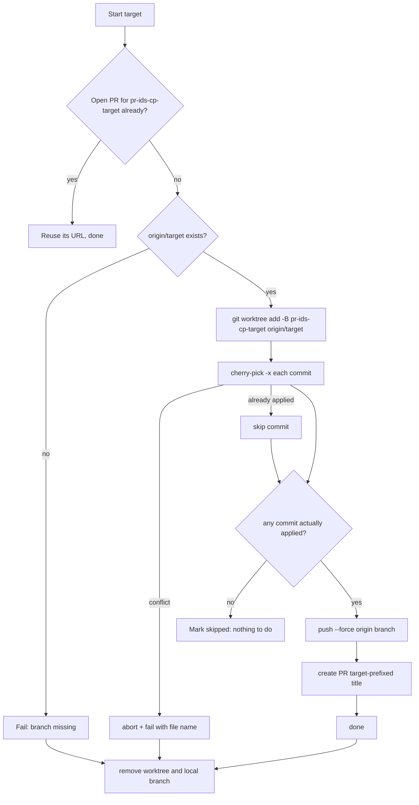

# Backend: architecture and code flow

The backend is a small Node.js (ESM) server. It does three jobs:

1. **Serves the built web UI** and a handful of REST endpoints (sign-in, repo checks, PR previews).
2. **Runs cherry-pick jobs** against a local git clone, using a temporary worktree per target branch.
3. **Streams job progress** to the browser over Socket.IO.

It runs on the user's machine and listens only on `127.0.0.1`.

```
Browser ──REST /api/*──────►  routes.js ──► auth.js / git.js / github.js
   │
   └─Socket.IO (job:*)─────►  socket.js ──► picker.js ──► git.js  (local clone, worktree)
                                                     └──► github.js (GitHub API)
```

## File map

| File | Responsibility |
|---|---|
| [`../index.js`](../index.js) | Entry point. Builds the Express app, applies the localhost guard, mounts `/api`, serves `client-vite/client/dist`, attaches Socket.IO, restores sign-in, opens the browser. |
| [`../config.js`](../config.js) | Loads the optional `.env` (`dotenv`). Imported first so env vars exist before anything reads them. |
| [`guard.js`](./guard.js) | `localOnly` middleware and `isLocalOrigin` for Socket.IO. Rejects any request whose `Host`/`Origin` is not `localhost`, `127.0.0.1` or `[::1]` (blocks other sites and DNS rebinding). |
| [`routes.js`](./routes.js) | REST API (below), plus the native folder chooser. |
| [`auth.js`](./auth.js) | The GitHub sign-in state. Token held **in memory only**. |
| [`github.js`](./github.js) | Thin Octokit wrapper plus `describeGithubError`. |
| [`git.js`](./git.js) | Runs git (`execFile`, no shell), inspects a repo, and manages temporary worktrees. |
| [`picker.js`](./picker.js) | **The core.** `startJob()` runs one cherry-pick job and maintains its state object. |
| [`store.js`](./store.js) | Encrypted on-disk store for the saved settings: server list and repository path (AES-256-GCM, owner-only, atomic writes with a `.bak`). |
| [`validate.js`](./validate.js) | `BRANCH_RE`, the shared branch-name rule used by the socket and the saved list. |
| [`socket.js`](./socket.js) | Socket.IO protocol: validation, the one-job-at-a-time lock, broadcasting job state. |

## REST API

All routes are under `/api` and return JSON (`{ error }` with a 4xx status on failure).

| Method & path | Purpose |
|---|---|
| `GET /config` | What the UI starts with. For both the server list and the repository path, the **saved** value wins (`serversStored` / `repoStored` are `true`); otherwise first-run defaults apply: `SERVER_BRANCHES`, and `GIT_BASE_DIRECTORY`+`REPO` or the folder the app was started from if it is a git repo **other than the app's own folder** (so a fresh clone doesn't pre-select itself). |
| `PUT /settings` | `{ servers?, repoPath? }` → saves in the encrypted store. Server names are validated (`BRANCH_RE`, max 200 chars, max 300 names). A repo path must be a real git repository (the verified top-level folder is what's saved), and an empty string clears it. Fields are merged, so saving one never wipes the other. |
| `GET /auth` | `{ signedIn, user, source }`. `source` is `gh`, `token` or `env`. |
| `POST /auth/gh` | Sign in using `gh auth token`. |
| `POST /auth/token` | Sign in with a pasted token (validated against GitHub first). |
| `POST /auth/logout` | Forget the token. |
| `POST /repo/inspect` | `{ path }` → validates a clone and returns `owner`, `repo`, default/current branch, dirty flag, remote branches. |
| `POST /repo/browse` | Opens the OS-native folder dialog (`osascript` / PowerShell / `zenity`) and returns the chosen path. |
| `POST /prs` | `{ owner, repo, ids }` → title, state, author, commit count for the PR previews. |

## Real-time protocol (Socket.IO)

Jobs are **long-running and owned by the server**, so the browser can refresh or reconnect at any time.
The server therefore sends the **complete job state** after every change, and the client simply replaces its copy.
There are no fragile partial updates to get out of order.

| Direction | Event | Payload |
|---|---|---|
| client → server | `job:start` (with ack) | `{ repoPath, prIds, envs, draft }` → ack `{ ok, error? }` |
| client → server | `job:cancel` | Cooperative cancel (takes effect after the current step). |
| client → server | `job:dismiss` | Forget a **finished** job (refused while running). |
| server → client | `job:snapshot` | `{ job, log }` or `null`. Sent on every (re)connect and when a job starts or is dismissed. |
| server → client | `job:update` | The full `job` object after every change. |
| server → client | `job:log` | One activity-log line `{ t, level, message }`. |

Only **one job runs at a time** (jobs share one clone). `socket.js` enforces this with a synchronous `starting` flag, so
two near-simultaneous `job:start` messages cannot both pass the check. Input is validated before anything runs: PR numbers
must be positive integers and branch names must match a strict pattern (no leading `-`, no `..`).

## Code flow: one cherry-pick job

`socket.js` → `startJob()` in `picker.js`. A job has two phases.

### 1. Prepare (once per job)

1. Read each PR from GitHub (`github.js`): title, body, merged state, and its commits (paginated; each commit records
   whether it is a merge commit).
2. `git fetch origin`, then `git fetch origin pull/<n>/head` for each PR so its commits exist locally even if the source
   branch was deleted or came from a fork.
3. Verify every commit exists locally. De-duplicate commits across PRs. Merge commits are marked "skipped".

### 2. Per target branch (sequential, isolated)



Details worth knowing:

- **Worktree isolation.** `git.js#withWorktree` creates a temp worktree under the OS temp dir and always removes it
  (plus the local branch) in a `finally`. The user's checkout and uncommitted changes are never touched.
- **Cherry-pick handling.** Uses `git cherry-pick -x --allow-empty`. On failure it checks for unmerged files: if any, it
  runs `cherry-pick --abort` and fails the target with the file list. If git says the commit is now empty, it runs
  `--skip` and records "Already on this branch". Anything else aborts and surfaces git's first error line.
- **Branch naming.** `pr-<ids joined by ->-cp-<target with unsafe chars replaced>`. The push uses `--force` because this
  is the tool's own namespaced branch (a leftover from an earlier failed run is simply replaced).
- **PR content.** Title `[<target>] <first PR title with every [..] tag removed>`. Body is a "Previous PR" list of every
  source PR followed by the first PR's original body. Optional draft.
- **Failure cleanup.** If a target fails after pushing but before its PR exists (or on cancel after the push), the pushed
  remote branch is deleted. A target that fails before pushing leaves nothing on the remote.
- **Failures are per target.** One failing branch does not stop the others. The job's overall status becomes `failed` if
  any target failed, `cancelled` if cancelled, else `done`.
- **Cancel.** Cooperative: checked between steps and commits, then the current target is cleaned up and the remaining ones
  are marked `cancelled`.

### The job state object

`startJob()` returns a plain JSON object that is mutated and re-emitted. The UI renders purely from it:

```jsonc
{
  "id": "uuid", "status": "running | done | failed | cancelled", "stage": "Picking into staging",
  "startedAt": 0, "finishedAt": null, "error": null,
  "repo": { "owner": "acme", "repo": "app" },
  "params": { "prIds": [42], "envs": ["staging"], "draft": false },
  "prs": [{ "number": 42, "title": "…", "url": "…", "merged": true, "commits": 3 }],
  "targets": [{
    "env": "staging", "status": "pending | running | done | failed | skipped | cancelled",
    "steps": [{ "id": "branch | pick | push | pr", "label": "…", "status": "…", "detail": "" }],
    "picks":  [{ "sha": "…", "subject": "…", "status": "pending | running | done | skipped | failed", "message": "" }],
    "prUrl": null, "note": "", "error": null
  }]
}
```

## Saved settings (`store.js`)

The only things persisted by the backend are the user's **server list** and **repository path**, so they outlive browsers and restarts (and the user never re-enters the repo path).

- **Format:** `NCP1 | salt(16) | iv(12) | auth tag(16) | ciphertext`. The plaintext is a small JSON object
  (`{ servers, repoPath, version, updatedAt }`). AES-256-GCM with the header as additional authenticated data; a fresh random salt
  and IV on every write, so identical content never produces identical bytes.
- **Key:** `scrypt(userName + homeDir + constant, salt)`. It is derived, not stored anywhere. This makes the file opaque and
  tamper-evident and ties it to the OS user, but it is obfuscation-grade, not a vault: anyone with the source and access
  to the same account can derive the key. By design the file holds no secrets. **Never add the GitHub token to it.**
- **Where:** `STORE_DIR` if set (used exclusively), else `<app folder>/.cherrypicker-data/`, else `~/.node-cherrypicker/`.
  Without `STORE_DIR`, reading checks both defaults in that order, so data written to the fallback is still found later.
  The folder is `700`, the file `600`.
- **Safe writes:** write to a temp file then `rename` (atomic). The previous good version is copied to `state.dat.bak`.
  If the existing file can't be decrypted, it is renamed `state.dat.corrupt-<time>` rather than overwritten, and `load`
  falls back to the `.bak`.
- **Source of truth:** the UI treats this file as the truth for both values (see the frontend README) and keeps
  `localStorage` only as a fast first paint and fallback. An explicitly empty saved value means "empty", not "unset", so
  first-run defaults (`SERVER_BRANCHES`, the start-folder repo) do not silently come back.

## Security design

- **Local only:** bound to `127.0.0.1`, plus Host/Origin checks on both HTTP and WebSocket (`guard.js`).
- **Token handling:** kept only in `auth.js` memory. Given to git through `GIT_CONFIG_COUNT/KEY/VALUE` environment
  variables (an `http.extraheader`), never on the command line and never written to disk or logs. SSH remotes use the
  user's own SSH keys instead.
- **No shell:** every git/gh/OS call uses `execFile` with an argument array. Branch names and SHAs are never concatenated
  into a command string.
- **Input validation:** PR ids and branch names are validated in `socket.js` before use.

## Configuration

See the root [README](../README.md#configuration). The server reads `PORT`, `SERVER_BRANCHES`, `GIT_BASE_DIRECTORY`,
`REPO`, `GITHUB_ACCESS_TOKEN`, `GITHUB_API_URL` (all optional), and `NO_OPEN` (skip opening the browser).

## Extending it

- **A new REST endpoint:** add it in `routes.js` using the `wrap()` helper (it handles errors and JSON).
- **A new job step:** add an entry to `STEP_DEFS` in `picker.js`, call `setStep()` around it, and the UI will render it
  (steps are data-driven).
- **Another git host:** the GitHub-specific parts are `parseGithubRemote` (`git.js`) and `github.js`.
